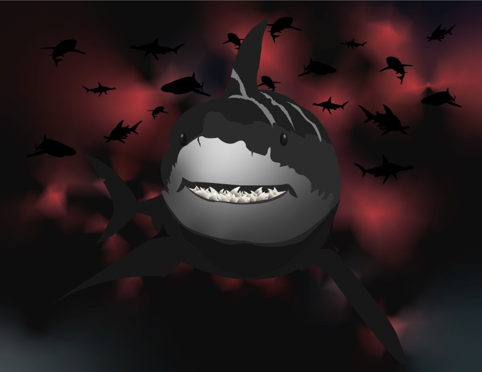

# He Ukana Aloha Kā Kīlauea

He Ukana Aloha Kā Kīlauea was a yearlong cultural webinar series where each of the ten UH campuses were given the opportunity to share
the mele, hula, and moʻolelo that is specific to their location. This past May, I was one of the featured artists from Leeward Community 
College that illustrated images for a video project of the moʻolelo of Kaʻahupāhau. 

I produced two pieces of the antagonist, Mikololou. He is a man-eating shark who has traveled to the peaceful waters of
Puʻuloa or Pearl Harbor. Here in Puʻuloa, humans are unafraid of sharks because of the shark goddess, Kaʻahupāhau. Kaʻahupāhau has put a
kapu on killing humans and any shark who dares will be killed immediately. Mikololou kills a human and because of his size Kaʻahupāhau
devises a plan to get him drunk on ʻawa and kill him. 

   
With a tight deadline, this project gave me the opportunity to test: my efficiency with Adobe Illustrator, ability to generate ideas quickly, and successfuly produce professional artwork that satisfied the desire of the leader. 

