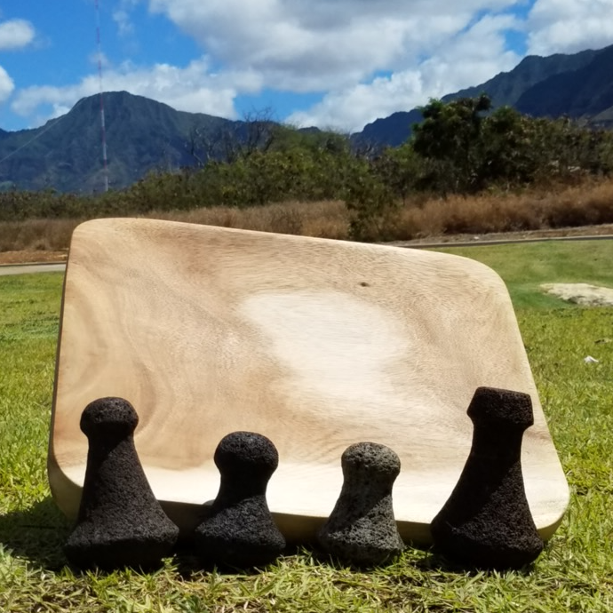

Board and Stone is a family-based class that teaches the Hawaiian tradition of hand-carving a papa kuʻi ʻai (poi board) and 
a pōhaku kuʻi ʻai (stone poi pounder) using natural materials gathered from the ʻāina. At the end of the 3-month long program, the 
families were required to finish one poi board and one poi pounder. 

When looking at the raw slab of wood and you have only an adze to carve it with, the task seems daunting. But what my family and I 
learned was that we needed to move together as a unit to accomplish this intimidating task. After the initial scare, we found that 
hitting a board with an adze and chipping away at a stone with a baby hammer was very therapeutic. Everyday we committed time to work
on our board and stone. This helped us disconnect from all the noise in our lives and to reconnect to the commitment we made to complete
this task. In the end, our determination and commitment not only to our project but to eachother produced a beautiful board and four poi 
pounders.

