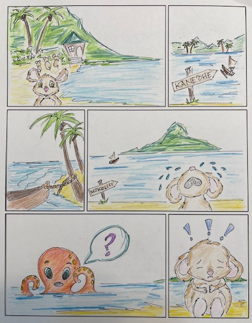
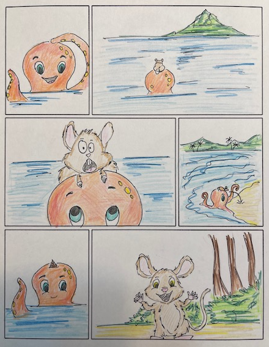
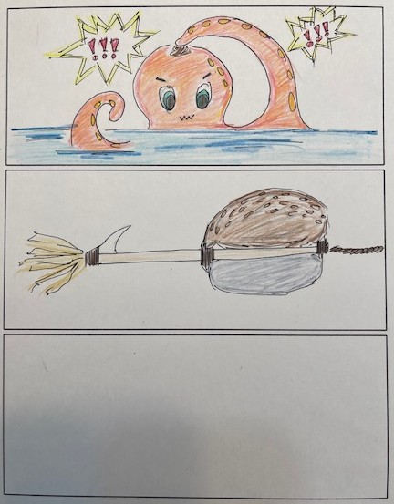

   
   
   
    

In ʻŌlelo Hawaiʻi 202, we were given a project to create a video of the story of the octopus and the rat. The requirement for this 
project was that we needed some sort of imagery and that the storytelling must be done completely in ʻōlelo Hawaiʻi. 

Initially I wanted to create an animated video. I was so excited to use, Powtoon, a cartoon animated because they advertised how easy 
it was to create your very own cartoon. My excitement quickly dissipated. The illustrations and movements were very limited, the sites were not 
user-friendly, and the free versions were "meh". So, I decided to draw the scenes from the story like a comic book. That was the easy 
part. Like most people in my class I didnʻt like hearing the sound of my own voice. Recording myself telling the story in ʻōlelo Hawaiʻi 
took a lot of takes, but I persevered.

While working on this project I realized that there are a lot of different avenues for me to explore in Software Engineering. Not being 
able to create an animated video was frustrating. But it made me think about video games. I am not a gamer, but maybe game development is 
something I might like. I have a passion for designing and a love for learning ʻōlelo Hawaiʻi. Maybe there is an opportunity for me to 
meld both my passions together in a video game. 

 
